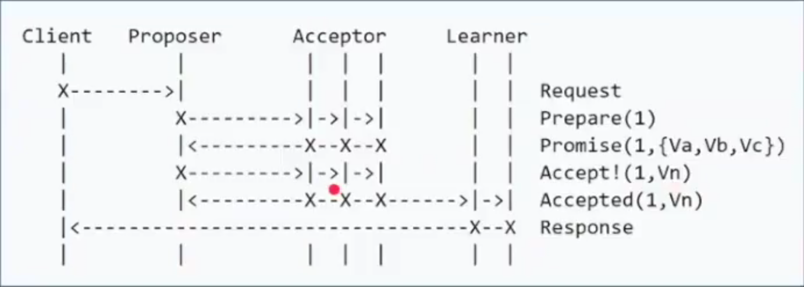
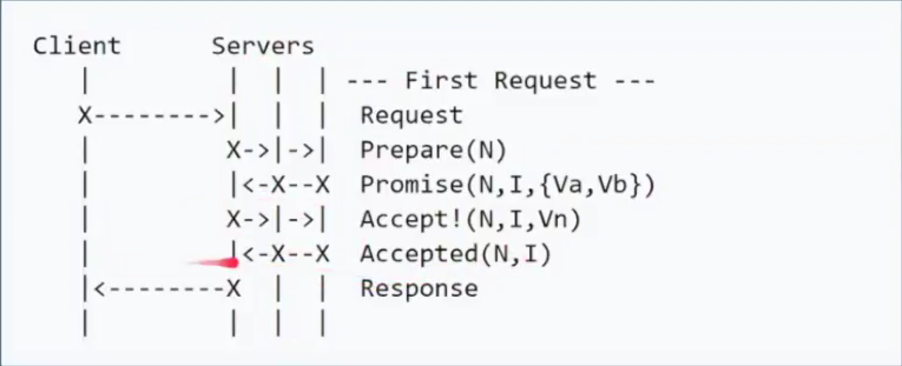

# Distributed Consensus

Notes from [video](https://www.youtube.com/watch?v=oLmAEsMZZP0).

### 什么是一致性

- [CAP theorem](https://en.wikipedia.org/wiki/CAP_theorem)
- 一致性模型
  - 弱一致性
    - 最终一致性
      - DNS
      - Gossip
  - 强一致性
    - 同步
      - 主从同步复制：节点失败，master阻塞，导致not available
    - Paxos(**多数派！**)
      - 多数派还不够，并发环境下，无法保证系统正确性，顺序很重要

### 强一致性算法

- Paxos(希腊城邦)
  - basic Paxos
    - roles: client, propser, acceptor(Voter), learner
    - 问题：难实现，效率低(2 rounds of RPC)，活锁
  - multi Paxos
    - roles: client, servers
  - fast Paxos
- Raft(multi-paxos)
  - 划分成三个子问题：
    - Leader Election
    - Log Replication
    - Safety
  - 重新定义角色：
    - Leader
    - Follower
    - Candidate
  - 原理动画解释：[http://thesecretlivesofdata.com/raft](http://thesecretlivesofdata.com/raft)
  - 场景测试：[https://raft.github.io](https://raft.github.io)
  - 一致性并不一定代表完全正确
- ZAB(multi-paxos)
  - 基本与Raft相同
  - ZAB将leader周期称为epoch，Raft里称为term
  - raft保证log连续性，心跳为leader至follower，ZAB相反。

### 项目实践

- Zookeeper
- etcd

---

### 划重点：

- **state machine replication**的共识算法
- 场景动画 http://thesecretlivesofdata.com/raft
- 场景测试 https://raft.github.io
- **一致性并不一定代表完全正确!**

