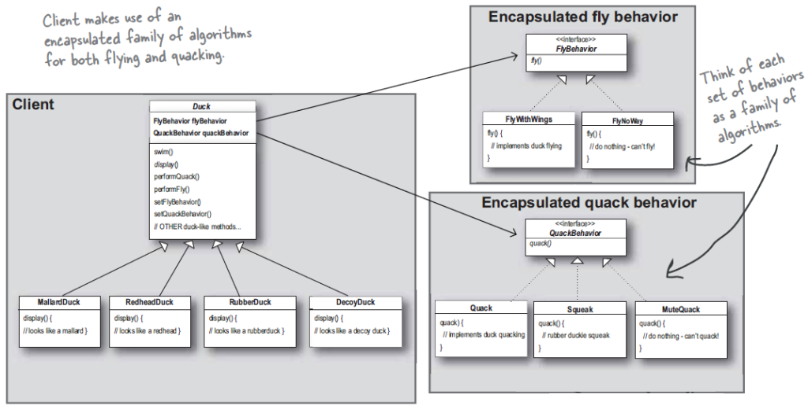

# Head First Design Patterns

## Why design patterns?

Someone has already solved your (software design) problems.

## Strategy Pattern

> **The strategy pattern** defines a family of algorithms, encapsulates each one, and makes them interchangeable. Strategy lets the algorithm vary independently from clients that use it.

### Design Principles

- Identify the aspects of your application that vary and separate them from what stays the same.
- program to an interface, not an implementation.
- Favor composition over inheritance.

### UML

