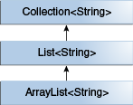
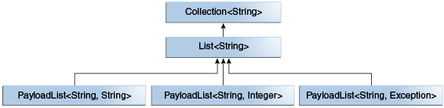

# Java Generics

Notes from [Java Tutorials, Generics](https://docs.oracle.com/javase/tutorial/java/generics/index.html).

> Generics allow you to abstract over types.

### Benefits

- Stronger type checks at compile time.
- Elimination of casts.
- Generic algorithms.

---

## Generic Types

> A generic type is a generic class or interface that is parameterized over types. 

### Generic class

format:

```java
class name<T1, T2, ..., Tn> { /* ... */ }
```

Example:

```java
public class Box<T> {
    private T t;

    public void set(T t) { this.t = t; }
    public T get() { return t; }
}
```

Naming conventions:

- E - Element
- K - Key
- N - Number
- T - Type
- V - Value
- S, U, V etc. - 2nd, 4rd, 4th type

### Raw Types

> A *raw type* is the name of a generic class or interface without any type arguments. E.g: `Box rawBox = new Box();`.

---

## Generic Methods

> *Generic methods* are methods that introduce their own type parameters.

Example: 

```java
public class Util {
    public static <K, V> boolean compare(Pair<K, V> p1, Pair<K, V> p2) {
        return p1.getKey().equals(p2.getKey()) &&
               p1.getValue().equals(p2.getValue());
    }
}

public class Pair<K, V> {

    private K key;
    private V value;

    public Pair(K key, V value) {
        this.key = key;
        this.value = value;
    }

    public void setKey(K key) { this.key = key; }
    public void setValue(V value) { this.value = value; }
    public K getKey()   { return key; }
    public V getValue() { return value; }
}

// invoke
Pair<Integer, String> p1 = new Pair<>(1, "apple");
Pair<Integer, String> p2 = new Pair<>(2, "pear");
Util.<Integer, String>compare(p1, p2);
```

---

## Bounded Type Parameters

*Bounded Type* restricts the types that can be used as type arguments in a parameterized type.

Example:

```java
public class Box<T> {

    private T t;          

    public void set(T t) {
        this.t = t;
    }

    public T get() {
        return t;
    }

    public <U extends Number> void inspect(U u){
        System.out.println("T: " + t.getClass().getName());
        System.out.println("U: " + u.getClass().getName());
    }

    public static void main(String[] args) {
        Box<Integer> integerBox = new Box<Integer>();
        integerBox.set(new Integer(10));
        integerBox.inspect("some text"); // error: this is still String!
    }
}
```

### Multiple Bounds

Type parameter can have multiple bounds: `<T extends B1 & B2 & B3>`.

### Generic Methods and Bounded Type Parameters

> Bounded type parameters are key to the implementation of generic algorithms.

```java
// Doesn't work!
public static <T> int countGreaterThan(T[] anArray, T elem) {
    int count = 0;
    for (T e : anArray)
        if (e > elem)  // compiler error
            ++count;
    return count;
}

// use a type parameter bounded by the Comparable<T> interface:
public interface Comparable<T> {
    public int compareTo(T o);
}

public static <T extends Comparable<T>> int countGreaterThan(T[] anyArray, T elem) {
    int count = 0;
    for(T e : anyArray) {
        if(e.compareTo(elem) > 0)
            ++count;
    }
    return count;
}
```

---

## Generics, Inheritance, and Subtypes

Box<Integer> is not a subtype of Box<Number> even though Integer is a subtype of Number.


Generics hierarchy.



More generics hierarchy.



---

## Wildcards

> In generic code, the question mark (?), called the *wildcard*, represents an *unknown type*. 

### Upper Bound Wildcards

```java
// format: <? extends upperBound>
public static void process(List<? extends Foo> list) { /* ... */ }

// method defined in upper bound can be used.
public static double sumOfList(List<? extends Number> list) {
    double s = 0.0;
    for (Number n : list)
        s += n.doubleValue();
    return s;
}
```

### Unbound Wildcards

> unbounded wildcard type is specified using the wildcard character (?), for example, List<?>.

Unbounded wildcard is a useful approach:

- If you are writing a method that can be implemented using functionality provided in the Object class.
- When the code is using methods in the generic class that don't depend on the type parameter. For example, List.size or List.clear. In fact, Class<?> is so often used because most of the methods in Class<T> do not depend on T.

### Lower Bounded Wildcards

> lower bounded wildcard restricts the unknown type to be a specific type or a super type of that type. A lower bounded wildcard is expressed using the wildcard character ('?'), following by the super keyword, followed by its lower bound: <? super A>.

```java
public static void addNumbers(List<? super Integer> list) {
    for (int i = 1; i <= 10; i++) {
        list.add(i);
    }
}
```

### Wildcards and Subtyping

relationship between `List<Integer>` and `List<Number>`.


Wildcards subtyping:


---

## Type Erasure

> Generics were introduced to the Java language to provide tighter type checks at compile time and to support generic programming. To implement generics, the Java compiler applies type erasure to:

- Replace all type parameters in generic types with their bounds or Object if the type parameters are unbounded. The produced bytecode, therefore, contains only ordinary classes, interfaces, and methods.
- Insert type casts if necessary to preserve type safety.
- Generate bridge methods to preserve polymorphism in extended generic types.

Type erasure ensures that no new classes are created for parameterized types; consequently, generics incur no runtime overhead.

---

## Restrictions

- Cannot instantiate Generic Types with Primitive Types
- Cannot create instances of Type Parameters
- Cannot Declare Static Fields Whose Types are Type Parameters
- Cannot use Casts or `instanceof` With Parameterized Types
- Cannot Create Arrays of parameterized Types
- Cannot create, catch, or throw Objects of Parameterized Types
- Cannot Overload a Method where the Formal Parameter Types of Each Overload Erase to the Same Raw Type

Examples:

```java
// Cannot instantiate Generic Types with Primitive Types
Pair<int, char> p = new Pair<>(8, 'a');  // compile-time error

// Cannot create instances of Type Parameters
public static <E> void append(List<E> list) {
    E elem = new E();  // compile-time error
    list.add(elem);
}

// workaround
public static <E> void append(List<E> list, Class<E> cls) throws Exception {
    E elem = cls.newInstance();   // OK
    list.add(elem);
}

// Cannot Declare Static Fields Whose Types are Type Parameters.
public class MobileDevice<T> {
    private static T os; // compile-time error

    // ...
}

// Cannot Use Casts or `instanceof` with Parameterized Types
public static <E> void rtti(List<E> list) {
    if (list instanceof ArrayList<Integer>) {  // compile-time error
        // ...
    }
}

// Cannot Create Arrays of Parameterized Types
List<Integer>[] arrayOfLists = new List<Integer>[2];  // compile-time error

// Cannot Create, Catch, or Throw Objects of Parameterized Types
// Extends Throwable indirectly
class MathException<T> extends Exception { /* ... */ }    // compile-time error

// Extends Throwable directly
class QueueFullException<T> extends Throwable { /* ... */ // compile-time error

public static <T extends Exception, J> void execute(List<J> jobs) {
    try {
        for (J job : jobs)
            // ...
    } catch (T e) {   // compile-time error
        // ...
    }
}

// however, use a type parameter in a throws clause
class Parser<T extends Exception> {
    public void parse(File file) throws T {     // OK
        // ...
    }
}

// Cannot Overload a Method Where the Formal Parameter Types of Each Overload Erase to the Same Raw Type
public class Example {
    public void print(Set<String> strSet) { }
    public void print(Set<Integer> intSet) { } // compile-time error
}
```
