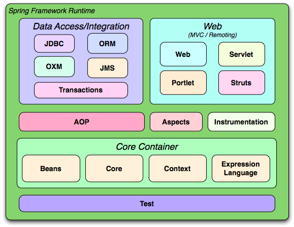

# Spring IoC

Ioc(Inversion of Control) a.k.a **Dependency Injection** in Spring framework. 



What does "Inversion of Control" mean?

When we write Java code, usually there is a bunch of classes, and each one can have one or more dependency classes. Therefore, when we want to instantiate the class, we need to instantiate all of it's dependency classes. In this case, **the classes are tightly coupled and the code is hard to test**. IoC/DI allows the classes to be loosely coupled and tested independently. A piece of code is worth more than a thousand words, let's look at an example from [this video](https://www.youtube.com/watch?v=rMLP-NEPgnM):

First we have a class:

```java
public class Employee {
    private String name;
    private int id;

    // setter and getter methods here
}
```

Without IoC, the main method would be like:

```java
public class Client {
    public static void main(String[] args) {
        Employee e = new Employee();
        e.name = "David";
        e.id = 101;
        
        System.out.print("Employee: " + e);
    }
}
```

With Spring IoC, first we need to configure a beans xml file, let's call it employee.xml here, with bean configuration like:

```xml
<?xml version="1.0" encoding="UTF-8"?>
<beans ...>
    <bean id="emp" class="com.example.Employee">
        <property name="name" value="John"/>
        <property name="id" value=102/>
    </bean>
</beans>
```

Then in the main method, we can do something like:

```java
ApplicationContext ctx = new ClassPathXmlApplicationContext("employee.xml");

Employee e = (Employee) ctx.getBean("emp"); // can getBean by class as well
System.out.print(e)
```

Combined with other feature of Spring IoC containers, it can automatically inject dependency objects for you.