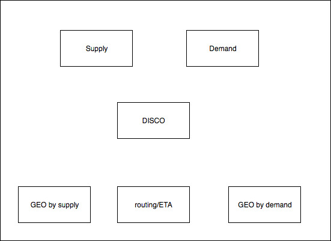

# Design Uber

Notes for [Design Uber Video](https://www.youtube.com/watch?v=oLmAEsMZZP0).

### Micro-service architecture

- User Service
- Dispatch Service
- Location Service

### Application - data structure and algorithms

Location: **[Geohash](https://en.wikipedia.org/wiki/Geohash)**, and more optimized: [Google S2](http://blog.christianperone.com/2015/08/googles-s2-geometry-on-the-sphere-cells-and-hilbert-curve/), hilbert curve, convert 2 dimensions to 1 dimension.

> - Given the circle from rider, S2 can return S2 cell IDs that are within the circle
> - Driver location has S2 Cell ID. So S2 cell IDs are basically the matching key

### Uber System 3.0

- Ringpop(Based on gossip protocal) for backend servers, RPC for gossip
- Chaos Monkey
- Circuit breaker
- Load balancer(client side LB to avoid SPOF)

