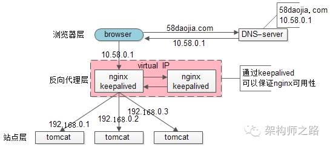
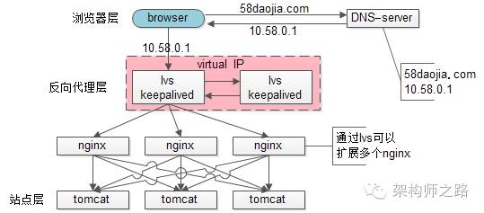

# 接入层Scale Out

公众号『架构师之路』最近讲到了接入层的Scale out技术，个人觉得很不错。基本上看了图就都能理解了。

### 单机时代

### DNS轮询

### Nginx反向代理

### Nginx+Keepalive

### 

### Scale up扩容方案 lvs/f5

### scale out扩容方案 DNS轮询

原文[链接](https://mp.weixin.qq.com/s/-tkXEjmzW92W5p43sf2h2w)。

