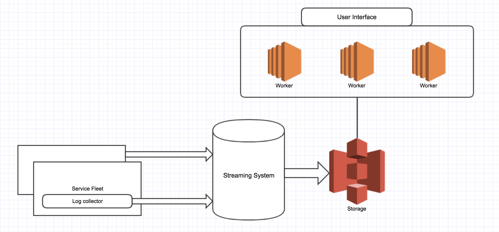

# 超大规模日志存储、分析系统构架

集中式日志服务(Central Logging Service)基本上是微服务构架下的一个标配服务。市面上流行的有一些logging service提供商，比如Sp家，还有一些流行的开源解决方案，比如ELK。这些服务都不错，但是如果数据量真的非常大，超过几百TB或者PB级别，用这些服务要么是贵的离谱，要么就是稳定性不够。长期稳定的运维一个超大规模的Elasticsearch cluster并不是一件很容易的事情。别问我是怎么知道的，嘿嘿。这里我就提供一点超大规模的日志服务的构架思路。

首先，为什么Elasticsearch无法处理PB级别的日志数据呢？一个重要的原因是Elasticsearch是一种存储和计算耦合在一起的结构，data node既是存储，又要负责索引，计算等任务。这样导致读写操作之间会相互影响，一个data node的丢失就会消耗大量的cluster资源来恢复，影响性能。所以要想稳定的支持PB级别的日志数据，计算和存储分离几乎是一个必然的前提。

存储可以选择像S3或者HDFS这些成熟稳定的方案。计算的构架可以参考[Presto](https://prestodb.io/)和[Impala](https://impala.apache.org/overview.html)这些系统，其实我这里提到的构架就跟这些系统的构架非常相似。简单解释一下。不同于Elasticsearch这种对数据进行倒排索引，然后搜索的时候直接从index里查找，这种计算存储分离的构架的运行思路是在需要进行分析的时候去提取，处理相应部分的数据。同时，为了能够在秒级以内完成数据的扫描和分析，我们可以对日志进行简单的预处理，找出日志数据对应的时间戳。这样在做日志分析的时候，对于给定的时间段，就能够快速定位相应的日志数据位置，并行处理，快速得出结果。这样做的一个限制就是要求每次分析都提供一个时间段，如果没有时间段的信息那就需要扫描所有数据。同时，根据分析模式的不同，选择正确的数据存储结构，比如columnar storage之类的也是一个需要考虑的点。然后类SQL interface也基本上是一个标配。

基本构架如下图：

补充：

从Elasticsearch的full text index到类似于map reduce的full scan，这是一个design spectrum，可以根据具体的需求在这个空间里进行取舍。
