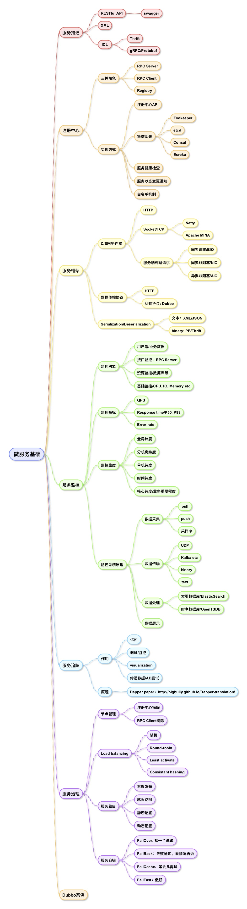

# 从0开始学微服务

『从0开始学微服务』是微博技术专家胡忠想老师在极客时间上开设的一门专栏。刚刚更新完毕，我一路跟着学习过来，收获不小。在这里做一个总结吧。

### 结缘微服务

其实我自己是在2012年刚毕业的第一份工作就开始接触微服务了，那个时候我们组做的是一套分布式音视频转码系统，为了能够应对每天成千上万的视频转码任务和流量的增长，我们就采用了所谓的『微服务』构架。当时我们的系统主要由三个子系统组成，系统之间用HTTP RESTful API通信，注册中心采用zookeeper。当时对Microservice还没有多少概念，只是觉得系统构架挺有意思的。后来又在另一家公司主导了从单体服务转型到微服务的项目，所以对微服务也算是有自己的一些心得了。

### 从0开始学微服务

####  微服务基础

#### 微服务实践(to be continued...)

